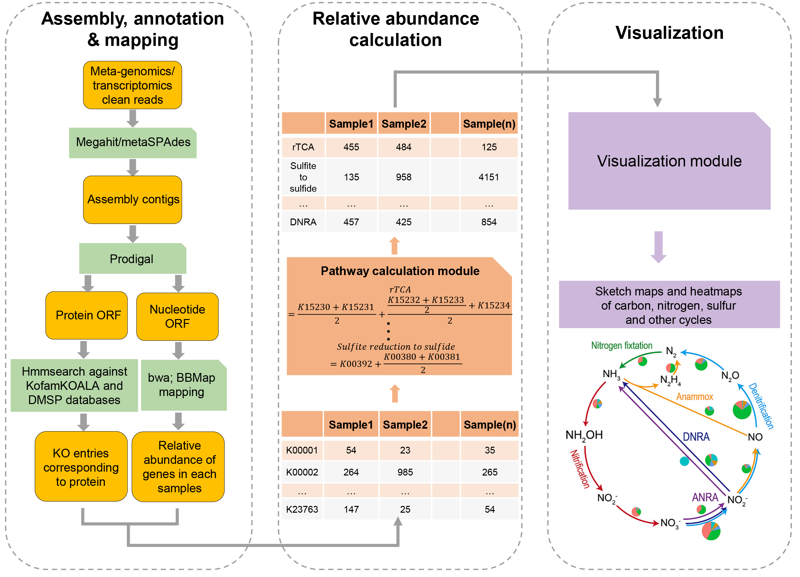

# DiTing
## Etymology
**DiTing** is a Chinese mythical creature who knows everything when he puts ears on the earth's surface. Parallelly, this program is developed to recognize biogeochemical cycles from environmental omic data accurately and efficiently.    
**谛听(DiTing)** 若伏在地下，一霎时，便可将四大部洲山川社稷、洞天福地之间， 蠃虫、鳞虫、毛虫、羽虫、昆虫，天仙、地仙、神仙、人仙、鬼仙，顾鉴善恶，察听贤愚。

## Citation
To cite DiTing please use  
`DiTing: A Pipeline to Infer and Compare Biogeochemical Pathways From Metagenomic and Metatranscriptomic Data`  

## Introduction
DiTing is designed to determine the relative abundance of metabolic and biogeochemical functional pathways in a set of given metagenomic/metatranscriptomic data. The input is expected to be a folder containing a group of paired-end clean reads. These reads will be assembled, annotated, and parsed for producing a table of relative abundance of elemental/biogeochemical cycling pathways (e.g., Nitrogen, Carbon, Sulfur) in each sample. Sketch maps and heatmaps will also be produced accordingly for comparing biogeochemical functions visually.

## Procedure


## Dependencies
* [Megahit](https://github.com/voutcn/megahit)
* [SPAdes](https://cab.spbu.ru/software/spades/)
* [Prodigal](https://github.com/hyattpd/Prodigal)
* [bwa](https://github.com/lh3/bwa)
* [BBMap](https://github.com/BioInfoTools/BBMap)
* [HMMER3](http://hmmer.org/)
* [python3](https://www.python.org/downloads/)
* Python modules: 
    * [Pandas](http://pandas.pydata.org/pandas-docs/stable/install.html)
    * [matplotlib](http://matplotlib.org/users/installing.html)
    * [opencv](https://pypi.org/project/opencv-python/)
    * [Pillow](https://pypi.org/project/Pillow/)
    * [seaborn](https://seaborn.pydata.org/index.html)
* KofamKOALA hmm database (ftp://ftp.genome.jp/pub/db/kofam/)
    * ko_list.gz (ftp://ftp.genome.jp/pub/db/kofam/ko_list.gz)
    * profiles.tar.gz (ftp://ftp.genome.jp/pub/db/kofam/profiles.tar.gz)

## Installation
Recommended configuration:  
```
CPU threads ≥ 8  
RAM ≥ 64 Gb
```
### Option 1: Conda (recommended)
Configure conda environment
```bash
# order matters
conda config --add channels defaults
conda config --add channels conda-forge
conda config --add channels bioconda
conda config --add channels silentgene
```
Set up a `Diting` environments
```bash
conda create -n diting-env 
```
Activate `diting-env` and install `DiTing` program
```bash
conda activate diting-env
conda install -c silentgene diting
```
Deactivate diting-env
```bash
conda deactivate
```
### Option 2: Repository from GitHub
#### Step 1. Download main scripts
`git clone https://github.com/xuechunxu/DiTing.git`
or click the green button `Clone or download` and select `download ZIP` to download the repo  and unzip manually.

#### Step 2. Download databases
DiTing requires [KofamKOALA hmm database](https://www.genome.jp/tools/kofamkoala/). This database will be downloaded and unzipped automatically on the first run. 
You can also download the database manually. This database should be stored in the same directory with the `diting.py` scripts. 

```bash
# At the home directory of this program
mkdir kofam_database
cd kofam_database
wget -c ftp://ftp.genome.jp/pub/db/kofam/ko_list.gz 
wget -c ftp://ftp.genome.jp/pub/db/kofam/profiles.tar.gz 
gzip -d ko_list.gz
tar zxvf profiles.tar.gz 
```
####  Step 3. Install the Dependencies
The [Dependencies](#Dependencies) are required to be installed and added to the system `$PATH`

## Running
### 1. One step running
```bash
diting.py -r <clean_reads_dir> -o <output_dir>  
diting.py -r <clean_reads_dir> -a <metagenomic_assembly> -o <output_dir>
```
Example reads run:  
```bash
#download the example reads  
Google Drive:  
URL: https://drive.google.com/file/d/132605rtKuA-Xx--eh3aC7i5WIExNWl5k/view?usp=sharing
after download, run:
gunzip Clean-reads_interleaved.zip

OR If you are in China, you can download from Baiduyun:  
URL: https://pan.baidu.com/s/1gFtJnz1G3pdEqBSFnUqFJw  
Password: diti

# run Example
diting.py -r Clean-reads_interleaved -o Clean-reads_interleaved.diting.out
```
The input is the `<clean_reads_dir>` folder containing a group of paired-end metagenomic clean reads, looks like: 
```
sample_one_1.fastq
sample_one_2.fastq
sample_two_1.fastq
sample_two_2.fastq
sample_three_1.fastq
sample_three_2.fastq
```
The paired-end metagenomic clean reads should end with `.fq`, `.fq.gz`, `.fastq`, or `.fastq.gz`.
The interleaved reads are also supported.
### 2. Optional parameter
#### 2.1 --spades
Using `metaSPAdes` instead of `megahit` to assemble reads

Consider setting memory limitation by `-m` when usign `SPAdes` as assembler

`-m(--memory) <int>` default: 50 (in Gb)

#### 2.2 -a (--assembly) metagenomic assembly
Path to a folder containing metagenomic assemblies corresponding to the provided reads, which is expected to have the same base name as the reads. The reads will not be assembled when this parameter was used.

```bash
python diting.py -r <clean_reads_dir> -a <metagenomic_assembly> -o <output_dir>
```
The `<metagenomic_assembly>` folder looks like: 
```
sample_one.fa
sample_two.fa
sample_three.fa
```
#### 2.3 Using interleaved paired-end reads
DiTing supports interleaved paired-end fastq files. Note that the reads type must be all interleaved or all separated. 
```bash
e.g. [clean_reads_dir] content:
samples1.fq.gz
samples2.fq.gz
samples3.fq.gz
samples4.fq.gz

```

#### 2.4 -n (--threads) number of threads
Number of threads to run (default: 4)

```bash
diting.py -r <clean_reads_Dir> -a <metagenomic_assembly> -o <output_dir> -n 20
```
#### 2.5 --noclean
The sam files would be retained if this flag was used. 
```bash
diting.py -r <clean_reads_dir> -a <metagenomic_assembly> -o <output_dir> -n 12 --noclean
```
#### 2.6 -vis (--visualization) pathways_relative_abundance.tab
Visualization can also be executed independently, which allows users to adjust the final result table (e.g., merge some similar samples) before the visualization.
```bash
diting.py -vis <pathways_relative_abundance.tab>
```
### 3. Output
#### 3.1 Table
- `pathways_relative_abundance.tab` :The final result with the relative abundance of pathways in each sample. 
- `ko_abundance_among_samples.tab` : A table with the relative abundance of each `k_number` of KEGG annotation is produced in `KEGG_annotation` folder. 

#### 3.2 Visualization
- `carbon_cycle_sketch.png`, `nitrogen_cycle_sketch.png`, `DMSP_cycle_sketch.png` and `sulfur_cycle_sketch.png`
Sketch maps regarding carbon, nitrogen and sulfur cycles
- `carbon_cycle_heatmap.pdf`, `nitrogen_cycle_heatmap.pdf`, `sulfur_cycle_heatmap.pdf` and `other_cycle_heatmap.pdf`
Heatmaps regarding carbon, nitrogen, sulfur cycles and other pathways

Example:
`sketch`look like:


`heatmap`look like:


## Copyright
Xue Chunxu, xuechunxu@outlook.com  
Heyu Lin, heyu.lin@student.unimelb.edu.au  
Xiaoyu Zhu, xiaoyuzhu321@126.com  
Xiao-Hua Zhang, xhzhang@ouc.edu.cn  
Lab of Microbial Oceanography  
College of Marine Life Sciences, Ocean University of China, Qingdao 266003, China
